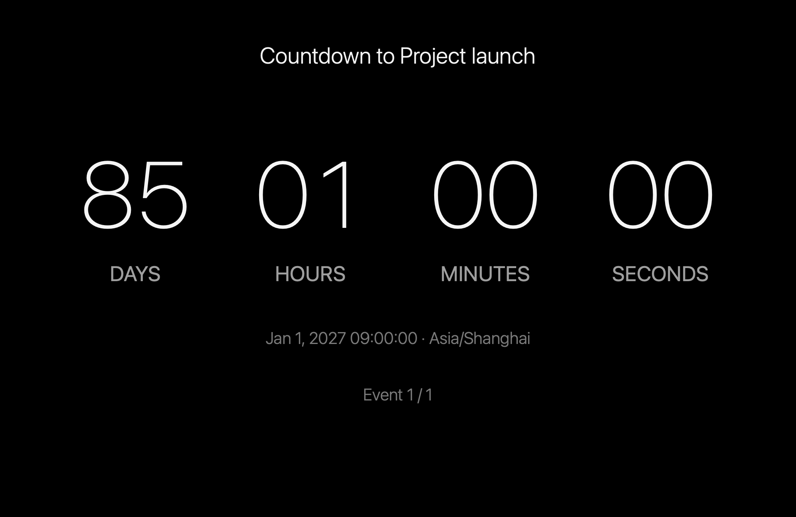

[English](README.md) | [简体中文](README.zh-CN.md)

# macOS Countdown Screen Saver

A native macOS screen saver with a minimal black-background design, displaying countdowns for up to five chronological events.



## Features

- Set up to five one-time target dates and times, precise to seconds.
- Choose Gregorian or Chinese lunar dates, including distinct leap-month options and valid month lengths.
- Automatically sort events, group simultaneous targets, skip expired events, and advance to the next target.
- Display large days/hours/minutes/seconds digits, event names, target dates, and an optional next-event hint.
- Move the entire text region every 60 seconds by default, within safe screen boundaries. Movement can be disabled; previews remain fixed.
- Support explicit event time zones, DST gaps/repeated times, empty and all-completed states, and persistent settings.
- Default to Chinese when the primary system language is Chinese, and English for every other language. Manually select System, English, or 中文. All Chinese variants use Simplified Chinese in this version.
- Adapt to small previews, portrait screens, Retina displays, and independent display views.
- Convert lunar dates offline using Hong Kong Observatory calendar data, with reference fixtures from day-memory.

## Download and Install

Download the saver ZIP for **arm64 (Apple Silicon)** or **x86_64 (Intel)** from [Releases](https://github.com/zfdang/macos-countdown-screensaver/releases), unzip it, and double-click `Countdown.saver` to install. Alternatively, copy the bundle into `~/Library/Screen Savers/`. In System Settings → Screen Saver, choose Countdown and open Options to configure targets, language, and appearance.

Current builds use ad-hoc signatures and are not Apple-notarized. macOS may require approval in Privacy & Security. The deployment target is macOS 13; local host acceptance was performed on macOS 15.8. See the acceptance report for the exact verification scope.

The preview ZIP contains `Countdown Preview.app`, which provides the same rendering and settings without starting a system screen saver. It shares settings with the saver.

## Build and Test

With Xcode installed:

```sh
export DEVELOPER_DIR=/Applications/Xcode.app/Contents/Developer
swift test --enable-code-coverage
python3 -m unittest discover -s Tests/BuildTests -v
scripts/build.sh all
scripts/acceptance.sh arm64
```

Build outputs are in `dist/`; `all` creates ARM, Intel, and Universal bundles. Use `scripts/build.sh arm64` or `scripts/build.sh x86_64` to build only one architecture. A full Git checkout and Python 3.9+ are required for version metadata.

GitHub Actions tests both architectures for each PR. After a merge/push to `main`, successful tests and bundle acceptance automatically publish a new GitHub Release with separate ARM and Intel builds. Versions use **`vYY.MM.DD-<Git commit count>`**, taking the latest commit's date in Asia/Singapore and all commits reachable from HEAD. Both architectures share the same version.

## Documentation

- [Design proposal](doc/design-proposal.md)
- [Calendar data and reference validation](doc/calendar-data.md)
- [Build and release workflow](doc/build-and-release.md)
- [Local acceptance report](doc/acceptance-report.md)

Design and technical documents are in English; the README is available in English and Chinese. Annual recurring events are outside this version.
