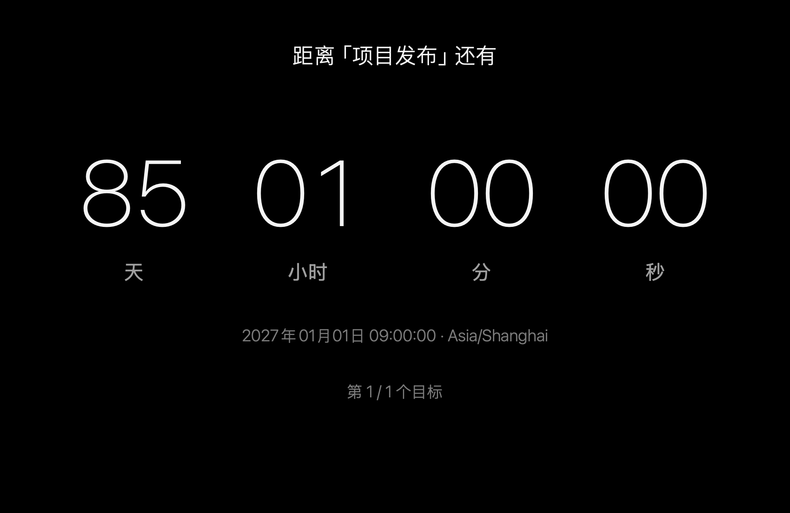

[English](README.md) | [简体中文](README.zh-CN.md)

# macOS 倒计时屏幕保护程序

一款采用简洁黑底界面的原生 macOS 屏幕保护程序，显示最多五个目标时间的倒计时。



## 功能

- 最多设置五个一次性目标日期和时间，精确到秒。
- 支持公历和中国农历；闰月为独立选项，日期列表按月份实际天数生成。
- 按时间自动排序，同时到期的目标合并展示，跳过已到期目标并切换到下一个。
- 采用大数字显示天、小时、分、秒，同时显示目标名称、日期及可选的下一目标提示。
- 默认每 60 秒移动整个文字区域，并保持在屏幕安全边界内。可关闭移动；预览保持固定位置。
- 支持目标时区、夏令时缺失或重复时间、未设置和全部完成状态，配置保存在本机。
- 默认检测系统首选语言：中文显示中文，其他语言一律显示英文。也可手动选择“跟随系统”“English”或“中文”。首版中文界面统一使用简体中文。
- 适配小尺寸预览、竖屏、Retina 及独立显示器视图。
- 使用香港天文台历表离线换算农历。

## 下载与安装

在 [Releases](https://github.com/zfdang/macos-countdown-screensaver/releases) 下载对应 **arm64（Apple Silicon）** 或 **x86_64（Intel）** 的屏保 ZIP，解压后双击 `Countdown.saver` 安装；也可以复制到 `~/Library/Screen Savers/`。在“系统设置 → 屏幕保护程序”中选择 Countdown，通过“选项”设置目标、语言和外观。

当前构建使用临时代码签名，尚未经过 Apple 公证，macOS 可能要求在“隐私与安全性”中批准。编译最低目标系统为 macOS 13；本地宿主验收在 macOS 15.8 上完成，具体验证范围见验收报告。

预览 ZIP 中提供 `Countdown Preview.app`，无需启动系统屏保即可查看相同界面并设置目标；它与屏保共享配置。

## 构建与测试

安装 Xcode 后执行：

```sh
export DEVELOPER_DIR=/Applications/Xcode.app/Contents/Developer
swift test --enable-code-coverage
python3 -m unittest discover -s Tests/BuildTests -v
scripts/build.sh all
scripts/acceptance.sh arm64
```

构建结果位于 `dist/`；`all` 会生成 ARM、Intel 和 Universal 版本。使用 `scripts/build.sh arm64` 或 `scripts/build.sh x86_64` 可单独构建某个架构。版本信息生成需要完整 Git 历史和 Python 3.9+。

GitHub Actions 会为每个 PR 测试两个架构。合并或推送到 `main` 后，只有单元测试和 bundle 验收全部通过，才会自动发布新的 GitHub Release，提供独立的 ARM、Intel 构建。版本号为 **`vYY.MM.DD-<Git 提交次数>`**：日期采用最近一次提交在 Asia/Shanghai 时区的日期，次数统计当前 HEAD 可达的全部提交；两个架构版本号一致。

## 文档

- [设计方案](doc/design-proposal.md)
- [历法数据与验证](doc/calendar-data.md)
- [构建与发布流程](doc/build-and-release.md)
- [本地验收报告](doc/acceptance-report.md)

设计和技术文档统一使用英文；README 提供独立的英文和中文版本。每年重复事件不属于当前版本。
